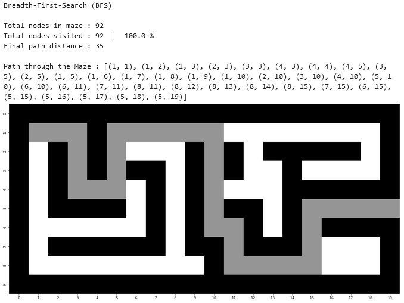
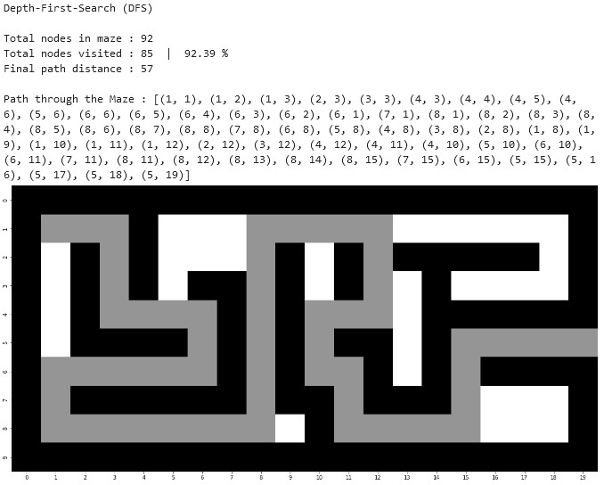

# Uninformed search

The search algo only uses information from the problem definition. Uses **Systematic** generation of nodes to reach goal state.

## Breadth first search

Expand all nodes in the current level before expanding other nodes. Uses a **FIFO** queue to do search.  
Completeness: Yes, if solution exist, the solution can always be found  
Time complexity: b^d  
Space complexity: b^d, since each node must be kept in memory to return the solution  
Optimal: Yes, if each step has equal cost since we are doing level expansion 

## Uniform cost search

Similar to breadth search but considers the cost of each step and expands the nodes with the lowest cost.  
FIFO queue is swapped out for a **Priority** queue. Uses a cost function g(n) to evaluate priority  
Completeness: Yes, if solution exist, the solution can always be found  
Time complexity: # nodes with g(n) <= cost of optimal solution (number of nodes dequeued)  
Space complexity: # nodes with g(n) <= cost of optimal solution  
Optimal: Yes

## Depth first search

Expands the nodes by seeking based on depth. Uses a **LIFO** stack and we assume there is no structure to keep track of the path travelled.  
Completeness: if there are loops then solution may not be found, but can be solved with repeated state checking. if space is finite without loops, then solution can be found.  
Time complexity: b^d  
Space complexity: b*d, algo must store all possible nodes for backtrack, then if branching factor is 3 and algo always takes the left path, then for each level travelled down, the algo must store 2 additional nodes for backtracking  
Optimal: No, multiple path may exist and the path by going through depth first may not be the most efficient

## Depth limited search

Similar to DFS, but applies a cut-off limit  
Completeness: if cut-off>=d  
Time complexity: b^d  
Space complexity: b*d  
Optimal: No, the issue is similar to DFS

## Iterative deeping search

Similar to DFS, but increases the depth search incrementally. Similar concept to BFS on level checking, but algo looks deep on a selected level basis.  
Completeness: Yes, since solution can be found for some depth  
Time complexity: b^d  
Space complexity: b*d  
Optimal: Yes, since solution only first encountered when d=solution depth

## Summary

| Factor | BFS | UCS | DFS | Depth limited | Iterative deepening |
| --- | --- | --- | --- | :---: | :---: |
| Time | b^d | b^d | b^d | b^l | b^d |
| Space | b^d | b^d | b&times;d | b&times;l | b&times;d|
| Optimal | Y | Y | N | N | Y |
| Complete | Y | Y | N | Y, l>=d | Y |

References:

- <https://www.javatpoint.com/ai-uninformed-search-algorithms>
